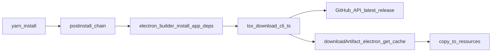

# Automated CLI download with `@electron/get`

## Current repo facts

- [`package.json`](f:\Workspace\1.Github\duplicate-files-manager\package.json) already has `"postinstall": "electron-builder install-app-deps"`. This must be **extended** (not replaced), e.g. `electron-builder install-app-deps && tsx scripts/download-cli.ts` (see TypeScript execution below).
- [`src/handlers/cli/helpers.ts`](f:\Workspace\1.Github\duplicate-files-manager\src\handlers\cli\helpers.ts) resolves the CLI as a **file** at `path.join(..., 'resources', 'library-organizer-cli' | 'library-organizer-cli.exe')` — i.e. project root [`resources/`](f:\Workspace\1.Github\duplicate-files-manager\resources), **not** a nested folder named `library-organizer-cli`.
- **Packaging mismatch**: `build.extraResources` still references `resources/library-organizer.exe` and `resources/library-organizer`. Those should be updated to `resources/library-organizer-cli.exe` and `resources/library-organizer-cli` so packaged apps match `getCliPath()`.
- **Upstream assets today**: [latest release](https://api.github.com/repos/Youssef-ben/library-organizer-cli/releases/latest) (`v1.0.0`) only includes **`library-organizer-cli.exe`**. The script should implement the cross-platform naming you described, but **macOS/Linux installs will fail with a clear message** until matching assets exist (e.g. `library-organizer-cli-linux-x64`, `library-organizer-cli-darwin-arm64`).

## API choice: `download()` vs `downloadArtifact()`

- [`download(version, options)`](https://github.com/electron/get/blob/v4.0.3/src/index.ts) always uses `artifactName: 'electron'`, so cache entries and filenames are Electron-oriented unless you rely only on `mirrorOptions.customFilename` for the URL (the cache basename still follows `getArtifactFileName` for non-generic artifacts).
- For a **generic GitHub Release binary**, the correct primitive is **`downloadArtifact({ isGeneric: true, version, artifactName: remoteAssetName, mirrorOptions: { ... } })`**: the cache key and local filename align with the real asset name, and the URL is still built as `mirror + customDir + '/' + customFilename` per [`getArtifactRemoteURL`](https://github.com/electron/get/blob/v4.0.3/src/artifact-utils.ts).

**Recommendation:** implement with **`downloadArtifact`** + `isGeneric: true`. If you must satisfy a literal “use `download`” wording, the same mirror options can be passed to `download()`, with the caveats above; behavior is cleaner with `downloadArtifact`.

## Required `@electron/get` options for non-Electron repos

- Set **`unsafelyDisableChecksums: true`**. For generic artifacts, checksum verification is skipped only when `semver.lt(version, '1.3.2')`; CLI versions **≥ 1.3.2** would otherwise try to fetch **`SHASUMS256.txt`** from your mirror, which GitHub CLI releases typically do not ship — causing hard failures without this flag.

## Mirror URL shape (GitHub Releases)

Use a **trailing slash** on `mirror` so concatenation yields a valid URL:

- `mirror`: `https://github.com/Youssef-ben/library-organizer-cli/releases/download/`
- `customDir`: release tag as published (e.g. `v1.0.0`)
- `customFilename`: exact asset name (e.g. `library-organizer-cli-win32-x64.exe`)

Final URL matches GitHub’s pattern: `.../releases/download/v1.0.0/<asset>`.

## Executable bit and `ensureExecutable`

**`@electron/get` v3/v4 types do not define `ensureExecutable`.** The library writes the bytes to cache and returns a path; it does not chmod Unix binaries for you.

**Plan:** after `fs.copyFile` into `resources/`, run `fs.chmod(dest, 0o755)` on non-`win32` platforms (and optionally skip if the file is not executable content).

## Caching (how `@electron/get` helps)

- Downloads are stored under the **Electron tool cache** (same as when downloading Electron): Linux `~/.cache/electron/`, macOS `~/Library/Caches/electron/`, Windows `%LOCALAPPDATA%\electron\Cache` (see package README).
- [`Cache.getPathForFileInCache`](https://github.com/electron/get/blob/v4.0.3/src/Cache.ts) hashes the download URL directory and uses the artifact filename; **repeat installs reuse the cached file** and skip network when the cache hits.
- The install script should **`copyFile` from the returned cache path** into `resources/` (do not move/delete cache files in default ReadWrite mode).

## `scripts/download-cli.ts` behavior (concise spec)

1. **Resolve output directory**: default `path.join(repoRoot, 'resources')`, overridable via env (e.g. `LIBRARY_ORGANIZER_CLI_RESOURCES_DIR`).
2. **Resolve version**: optional env pin (e.g. `LIBRARY_ORGANIZER_CLI_VERSION=1.0.0`); else `GET https://api.github.com/repos/Youssef-ben/library-organizer-cli/releases/latest` for `tag_name` and `assets`.
3. **Pick asset**:
   - Build candidate name(s) from `process.platform` / `process.arch` (normalize `arm64`, `x64`, `ia32` as needed).
   - Preferred pattern (document in script comment):  
     - Windows: `library-organizer-cli-win32-x64.exe` (and `ia32` if you publish it)  
     - macOS: `library-organizer-cli-darwin-x64`, `library-organizer-cli-darwin-arm64`  
     - Linux: `library-organizer-cli-linux-x64`, `library-organizer-cli-linux-arm64`, etc.
   - **Match against `assets[].name`** from the API when possible; if missing, print a clear error listing available assets.
4. **Download**: `downloadArtifact` with `isGeneric: true`, `unsafelyDisableChecksums: true`, `mirrorOptions` as above, `version` passed as semver without `v` (e.g. `1.0.0`) while `customDir` uses the full tag (`v1.0.0`).
5. **Install**: copy to **`library-organizer-cli.exe`** (Windows) or **`library-organizer-cli`** (Unix) under the resources dir (final names must match [`getCliPath()`](f:\Workspace\1.Github\duplicate-files-manager\src\handlers\cli\helpers.ts)); `chmod` on Unix.
6. **Logging**: start/skip-cache-hit (optional message via `@electron/get` behavior), success path, structured errors (network, 404, no matching asset).
7. **Optional**: `downloadOptions: { quiet: true }` to avoid long-run progress UI during `yarn install` if desired.

## `package.json` changes

- **devDependencies**: `@electron/get` `^3.0.0` **or** latest **`^4.0.3`** (your requirement allows latest; 4.x matches current npm `latest`).
- **devDependencies**: `tsx` (or `ts-node` + `tsconfig` include) because **`node scripts/download-cli.ts` does not run TypeScript** with stock Node.
- **scripts.postinstall**: chain CLI download after app deps, e.g.  
  `"postinstall": "electron-builder install-app-deps && tsx scripts/download-cli.ts"`

## Repo hygiene

- Update [`.gitignore`](f:\Workspace\1.Github\duplicate-files-manager\.gitignore) to ignore the Unix binary **`library-organizer-cli`** (currently only `library-organizer-cli.exe` is listed).
- Update [`package.json` `build.extraResources`](f:\Workspace\1.Github\duplicate-files-manager\package.json) to the `library-organizer-cli` / `library-organizer-cli.exe` paths.

## Example release asset naming (for maintainers)

Publish binaries on each GitHub release with names the script expects, e.g.:

- `library-organizer-cli-win32-x64.exe`
- `library-organizer-cli-linux-x64`
- `library-organizer-cli-darwin-arm64`

Today’s repo only has `library-organizer-cli.exe`; either rename future Windows assets to the pattern above **or** teach the script a **fallback** (e.g. if platform is win32 and only `library-organizer-cli.exe` exists, use that as the remote name but still copy to `library-organizer-cli.exe` locally).

