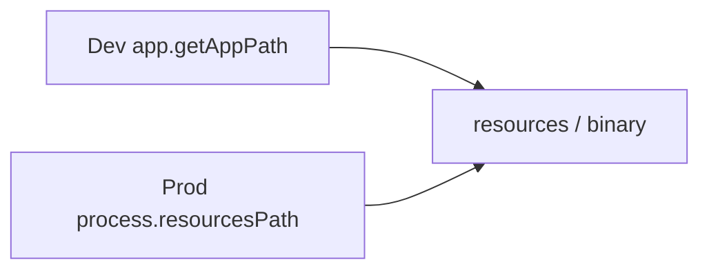

# Package external CLI with electron-builder and resolve paths

## Current state

- [`package.json`](f:\Workspace\1.Github\duplicate-files-manager\package.json) already has an `"build"` section with two `extraResources` entries that copy **each file** to the **root** of the packaged resources dir (`to: library-organizer-cli.exe` / `to: library-organizer-cli`), not under a `resources/` subfolder.
- [`src/handlers/cli/helpers.ts`](f:\Workspace\1.Github\duplicate-files-manager\src\handlers\cli\helpers.ts) already implements `getCliPath()` that resolves:
  - **Packaged**: `path.join(process.resourcesPath, 'resources', exeName)`
  - **Dev**: `path.join(app.getAppPath(), 'resources', exeName)`

So the **intended** runtime path is `.../resources/library-organizer-cli(.exe)` under `process.resourcesPath` when packaged. That requires `extraResources` to copy the **folder** `resources/` to **`to: "resources"`**, not flat filenames at the top level.

- There is also a stale [`electron-builder.yml`](f:\Workspace\1.Github\duplicate-files-manager\electron-builder.yml) (different `appId` / `asarUnpack` for `resources/**`). electron-builder **merges** config sources; you should either remove/reconcile this file or ensure it does not contradict `package.json` (otherwise builds can be confusing).

---

## 1. `package.json` — `"build"."extraResources"` JSON snippet

Replace the existing `extraResources` array with **one** rule that copies the whole project `resources/` tree into the app’s extra resources under `resources/`:

```json
"extraResources": [
  {
    "from": "resources",
    "to": "resources",
    "filter": ["**/*"]
  }
]
```

- **`from`**: `"resources"` (equivalent to `resources/` for a directory).
- **`to`**: `"resources"` → final on-disk location is `path.join(process.resourcesPath, 'resources', ...)` for each file, matching `getCliPath()` / the helper below.
- **`filter`**: include everything under that folder (icons, CLI, etc.). Narrow the filter later if you want to exclude large dev-only files.

**Executable permissions (macOS/Linux):** electron-builder copies files from disk; the Unix binary should already be `chmod +x` **before** packaging. If it was downloaded without the execute bit, run:

`chmod +x resources/library-organizer-cli`

---

## 2. TypeScript utility — `getCliBinaryPath` (main process)

Recommended placement: e.g. [`src/main/utils/getCliBinaryPath.ts`](f:\Workspace\1.Github\duplicate-files-manager\src\main\utils\getCliBinaryPath.ts) (or co-locate under `src/handlers/cli/` if you prefer). **Use from the main process** when spawning; the preload script normally should not spawn the CLI—keep execution in main (as in [`handler.ts`](f:\Workspace\1.Github\duplicate-files-manager\src\handlers\cli\handler.ts)).

```ts
import { app } from 'electron'
import path from 'node:path'

const CLI_BASE_NAME = 'library-organizer-cli'

/**
 * Absolute path to the library-organizer-cli binary.
 * - Packaged: <process.resourcesPath>/resources/<binary>
 * - Dev: <app.getAppPath()>/resources/<binary> (project root in typical electron-vite dev)
 */
export function getCliBinaryPath(): string {
  const name = process.platform === 'win32' ? `${CLI_BASE_NAME}.exe` : CLI_BASE_NAME
  const root = app.isPackaged ? process.resourcesPath : app.getAppPath()
  return path.join(root, 'resources', name)
}
```

**Notes:**

- Matches your existing `getCliPath()` logic; you can **replace** `getCliPath` with an import of this module to avoid duplication, or keep one function only.
- **Preload:** Spawning should stay in main. If the renderer ever needs the path for UI only, expose it via `ipcMain`/`contextBridge`—do not rely on `app` in preload if your preload is sandboxed.

---

## 3. Example: `child_process.spawn`

```ts
import { spawn } from 'node:child_process'
import { getCliBinaryPath } from './getCliBinaryPath'

const child = spawn(getCliBinaryPath(), ['--help'], {
  stdio: 'pipe',
  windowsHide: true // optional: hide console window on Windows for GUI apps
})
```

(Your existing [`handler.ts`](f:\Workspace\1.Github\duplicate-files-manager\src\handlers\cli\handler.ts) already does `spawn(getCliPath(), flags)`.)

---

## 4. Why `extraResources` (vs `extraFiles` / `asarUnpack`)

- **`extraResources`**: Puts files under the OS “Resources” location exposed as **`process.resourcesPath`**, outside **`app.asar`**. This is the standard place for **executables** you `spawn`, DLLs, and large assets that must be real files on disk.
- **`extraFiles`**: Copies into the application content area (layout varies by OS); not the usual choice when the agreed API is `process.resourcesPath` + a `resources/` subfolder.
- **`asarUnpack`**: Unpacks specific paths **from inside** the asar; useful for native addons or files that must sit next to app code, but it is the wrong primary tool for a standalone CLI you want cleanly under `resources/` next to other packager-managed files.

---

## 5. Testing notes (verify packaging)

1. **Build installers** using your existing scripts, e.g. `yarn build:win` / `yarn build:mac` / `yarn build:linux` (your repo uses `electron-vite build && electron-builder ...`; there is also `build:unpack` for a loose output dir).
2. **Inspect output** (paths differ by OS):
   - **Windows**: Under the unpacked app or `%LOCALAPPDATA%` install dir, check `resources\resources\library-organizer-cli.exe` (nested `resources` is correct given `to: "resources"`).
   - **macOS**: `Your.app/Contents/Resources/resources/library-organizer-cli`
   - **Linux (AppImage)**: mount or extract and inspect `resources/resources/library-organizer-cli`
3. **Unix executable bit**: `ls -l` / `stat` the non-Windows binary; ensure `-x` for owner (and that running it from a shell works).
4. **Smoke test**: Run the packaged app and trigger the code path that calls `spawn` on the resolved path; confirm process starts (watch Task Manager / Activity Monitor if needed).

---

## 6. Diagram (path resolution)



---

## Summary of actionable edits

| Area | Action |
|------|--------|
| [`package.json`](f:\Workspace\1.Github\duplicate-files-manager\package.json) | Replace per-file `extraResources` with folder copy `from: resources` → `to: resources` |
| TS helper | Add `getCliBinaryPath` (or unify with existing `getCliPath`) |
| [`helpers.ts`](f:\Workspace\1.Github\duplicate-files-manager\src\handlers\cli\helpers.ts) | Optionally dedupe by importing the new helper |
| [`electron-builder.yml`](f:\Workspace\1.Github\duplicate-files-manager\electron-builder.yml) | Reconcile or remove conflicting / stale entries (`asarUnpack: resources/**` may duplicate resource copies) |
