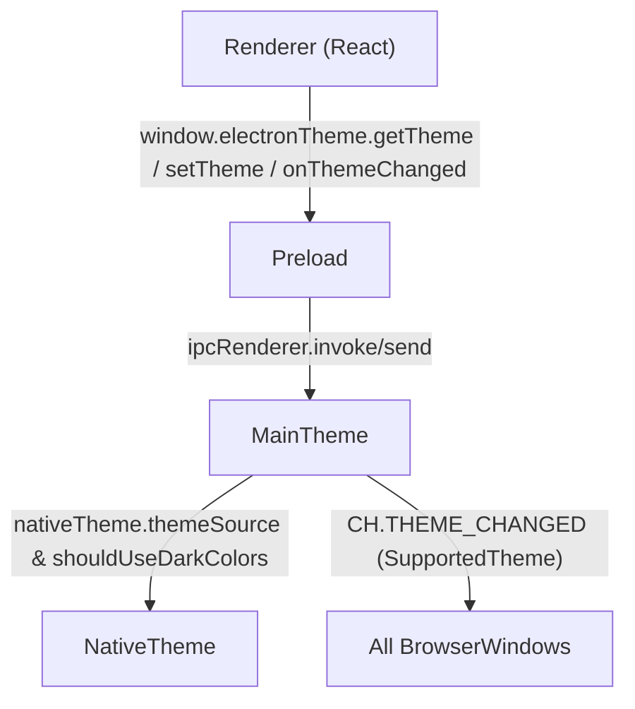

### Goals

- **Add shared theme types** so main and preload agree on `SupportedTheme` and `ThemePreference`.
- **Implement theme management in the main process** using `electron-store`, `nativeTheme`, and new IPC channels.
- **Expose a typed `electronTheme` bridge in preload** with `getTheme`, `setTheme`, and `onThemeChanged` (with unsubscribe), without touching renderer code.

### Files to Create/Update

- **Create** `[src/shared/theme.types.ts](src/shared/theme.types.ts)`
- **Update** `[src/main/ipc/channels.ts](src/main/ipc/channels.ts)`
- **Create** `[src/main/theme.ts](src/main/theme.ts)`
- **Update** `[src/main/ipc/handlers.ts](src/main/ipc/handlers.ts)` and/or `[src/main/index.ts](src/main/index.ts)` to initialize theme handling
- **Update** `[src/preload/index.ts](src/preload/index.ts)`
- **Create** `[src/preload/preload.d.ts](src/preload/preload.d.ts)` if it does not already exist

### High-Level Design

- **Shared types**
  - Add `src/shared/theme.types.ts`:
    - `export type SupportedTheme = 'dark' | 'light' | (string & {})`
    - `export type ThemePreference = SupportedTheme | 'system'`
  - Use these types in both main and preload layers.
- **IPC channels**
  - Extend `CH` in `src/main/ipc/channels.ts` with the exact strings:
    - `THEME_GET: 'theme:get'`
    - `THEME_SET: 'theme:set'`
    - `THEME_CHANGED: 'theme:changed'`
  - Reuse `CH` in both main handlers and preload `ipcRenderer` calls.
- **Main theme module (`src/main/theme.ts`)**
  - Import `nativeTheme`, `BrowserWindow`, `ipcMain` from `electron`, `Store` from `electron-store`, `CH` from `./ipc/channels`, and `SupportedTheme` / `ThemePreference` from `../shared/theme.types`.
  - Define a typed `Store` instance with schema `{ themePreference: ThemePreference }`, defaulting `themePreference` to `'system'` when not set.
  - Implement a small, extensible mapping helper, e.g. `mapPreferenceToThemeSource(pref: ThemePreference): 'dark' | 'light' | 'system'`:
    - if `pref === 'system'` → `'system'`
    - else if `pref` name includes `'dark'` → `'dark'`
    - else if `pref` name includes `'light'` → `'light'`
    - else fall back to `'system'` (or a clearly documented default) while still treating `pref` value as-is for resolved theme.
  - Implement `resolveTheme(pref: ThemePreference): SupportedTheme`:
    - if `pref === 'system'` use `nativeTheme.shouldUseDarkColors ? 'dark' : 'light'`
    - else return `pref` directly.
  - Export a function like `registerTheme(win: BrowserWindow): void` that:
    - Reads `themePreference` from the store on startup (default `'system'`).
    - Applies `nativeTheme.themeSource = mapPreferenceToThemeSource(pref)`.
    - Registers IPC handlers:
      - `ipcMain.handle(CH.THEME_GET, () => resolveTheme(currentPreference))`.
      - `ipcMain.on(CH.THEME_SET, (_e, pref: ThemePreference) => { update store, update` nativeTheme.themeSource`, broadcast` THEME_CHANGED`with`resolveTheme(pref)` to all windows }).
    - Subscribes to `nativeTheme.on('updated', ...)` and on each update:
      - Computes `resolved = resolveTheme(currentPreference)`.
      - Sends `resolved` via `THEME_CHANGED` to **all** `BrowserWindow.getAllWindows()`.
  - Keep the mapping helpers exported or easily discoverable for future theme extensions.
- **Wire main theme module into app startup**
  - In `src/main/index.ts` (or `src/main/ipc/handlers.ts` depending on architecture), after creating each `BrowserWindow`:
    - Call `registerHandlers(mainWindow)` as today.
    - Call `registerTheme(mainWindow)` from `./theme` to ensure IPC and listeners are set up per-window while still using a shared store and global `nativeTheme`.
  - Ensure this runs when the app is ready, and that any new windows created later (e.g. in `activate`) also have `registerTheme` invoked.
- **Preload: expose `window.electronTheme`**
  - In `src/preload/index.ts`:
    - Import `SupportedTheme` and `ThemePreference` from `../shared/theme.types` and `CH` from `../main/ipc/channels`.
    - Extend `contextBridge.exposeInMainWorld` to also define `electronTheme` alongside existing `api`:
      - `getTheme: () => ipcRenderer.invoke(CH.THEME_GET) as Promise<SupportedTheme>`.
      - `setTheme: (theme: ThemePreference) => ipcRenderer.send(CH.THEME_SET, theme)`.
      - `onThemeChanged: (cb: (theme: SupportedTheme) => void) => { register an` ipcRenderer.on(CH.THEME_CHANGED, ...)`; return an unsubscribe function that removes that specific listener }`.
    - Ensure `onThemeChanged` always passes a `SupportedTheme` and never `'system'`.
- **Preload typings**
  - Create `src/preload/preload.d.ts`:
    - Import `SupportedTheme` and `ThemePreference` from `../shared/theme.types`.
    - Extend the global `Window` interface with:
      - `electronTheme: { getTheme(): Promise<SupportedTheme>; setTheme(theme: ThemePreference): void; onThemeChanged(cb: (theme: SupportedTheme) => void): () => void }`.
    - Also include the existing `api` typing if needed (mirroring what is in `preload/index.ts`) so TS is aware of both bridges.
  - If your current TS configuration doesn’t already include `src/preload/preload.d.ts`, update the relevant `tsconfig` (likely `tsconfig.node.json` or similar, not `tsconfig.web.json`) to include it, keeping renderer configs untouched.

### Data Flow Overview

### Implementation Todos

- **types-shared**: Create `shared/theme.types.ts` and wire imports in main/preload.
- **ipc-channels-theme**: Extend `CH` with `theme:get`, `theme:set`, `theme:changed`.
- **main-theme-module**: Implement `main/theme.ts` with store, mapping helpers, IPC handlers, and `nativeTheme` listener.
- **main-wireup**: Call the theme registration function for each window in `main/index.ts` (and/or central handler registration point).
- **preload-bridge**: Extend `preload/index.ts` to expose `window.electronTheme` with the required API and unsubscribe behavior.
- **preload-types**: Add `preload/preload.d.ts` typing for `window.electronTheme` (and `api` if desired) using the shared theme types.

