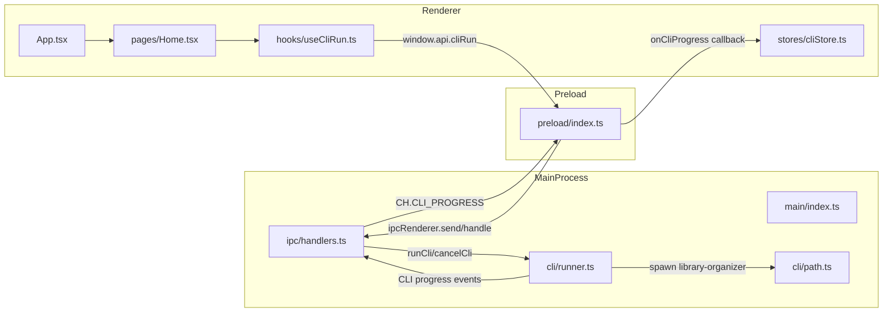

# Duplicate File Manager Electron App Setup

### 1. Bootstrap project and dependencies

- **Important**: Always use `yarn` (or `yarn dlx` / `yarn create`) instead of `npm` for all commands.
- **Create app skeleton**: From the repo root, run `yarn create @quick-start/electron@latest duplicate-file-manager -- --template react-ts` to scaffold an Electron-Vite + React + TypeScript app in `duplicate-file-manager/`. When prompted to "Add Electron updater plugin?", choose **No** to keep the template non-interactive.
- **Install base deps**: `cd duplicate-file-manager` then run `yarn install` to install the scaffolded dependencies.
- **Install state/query libs**: Add runtime helpers with `yarn add zustand @tanstack/react-query immer`.
- **Install Tailwind tooling**: Add Tailwind Vite plugin with `yarn add -D tailwindcss @tailwindcss/vite`.

### 2. Tailwind CSS integration

- **Wire Tailwind into Vite (renderer)**: Open `[electron.vite.config.ts](library-organizer-app/electron.vite.config.ts)` and locate the renderer Vite config. Import `tailwindcss`'s Vite plugin (from `@tailwindcss/vite`) and add it to the `plugins` array for the renderer bundle, keeping other existing plugins intact and following the current Electron-Vite configuration style.
- **Create global CSS entry**: In `[src/renderer/src/index.css](library-organizer-app/src/renderer/src/index.css)` create the file (or replace existing) with a single line `@import "tailwindcss";`.
- **Hook CSS into React entry**: In `[src/renderer/src/main.tsx](library-organizer-app/src/renderer/src/main.tsx)` import `./index.css` near the top so Tailwind styles are applied globally.

### 3. Restructure source layout

- **Reorganize `src` tree**: Inside `duplicate-file-manager/src/`, adjust folders and files to match exactly the requested structure, removing or renaming any default Electron-Vite scaffold files that conflict:
  - `src/main/index.ts` – keep the BrowserWindow + app lifecycle entry here (move from whatever Electron-Vite generated main entry file) and later wire `registerHandlers(win)`.
  - `src/main/ipc/handlers.ts` and `src/main/ipc/channels.ts` – new IPC-related folder and files.
  - `src/main/cli/runner.ts`, `src/main/cli/path.ts`, `src/main/cli/types.ts` – new CLI integration folder.
  - `src/preload/index.ts` – keep as the single preload entry and strip any logic beyond the specified `contextBridge.exposeInMainWorld` implementation.
  - `src/renderer/src/` – ensure nested structure `pages/`, `components/`, `stores/`, `hooks/`, `types/`, plus `App.tsx`, `main.tsx`, `index.css`.
- **Create placeholder view**: Add `[src/renderer/src/pages/Home.tsx](library-organizer-app/src/renderer/src/pages/Home.tsx)` with the minimal Tailwind-based placeholder component.
- **Wire `App` to `Home`**: In `[src/renderer/src/App.tsx](library-organizer-app/src/renderer/src/App.tsx)`, render the `Home` page as the main view (simple import and usage, no routing needed yet).
- **Keep renderer free of Electron imports**: Verify that no file under `src/renderer/` imports from `electron`; adjust any generated code that does so to instead rely on `window.api`.

### 4. Implement shared channels and CLI utilities

- **Channel constants**: Create `[src/main/ipc/channels.ts](duplicate-file-manager/src/main/ipc/channels.ts)` and add the provided `CH` constant containing all IPC channel string values.
- **CLI types**: Create `[src/main/cli/types.ts](duplicate-file-manager/src/main/cli/types.ts)` with the provided `ProgressEvent`, `SummaryEvent`, `CliEvent`, and `CliRunArgs` definitions.
- **CLI binary path resolver**: Create `[src/main/cli/path.ts](duplicate-file-manager/src/main/cli/path.ts)` and implement `getCliPath` exactly as given, importing `app` from `electron` and `path` from `path`.
- **CLI runner**: Create `[src/main/cli/runner.ts](duplicate-file-manager/src/main/cli/runner.ts)` with the provided implementation using `spawn`, `getCliPath`, `procs` map, line-buffered `stdout` handling, and `cancelCli` that kills and removes processes.

### 5. IPC handlers and main process wiring

- **IPC handlers**: Implement `[src/main/ipc/handlers.ts](duplicate-file-manager/src/main/ipc/handlers.ts)` exactly as given, wiring `ipcMain.handle` for `DIALOG_OPEN_FOLDER` and `ipcMain.on` listeners for `CLI_RUN` and `CLI_CANCEL` that delegate to `runCli`/`cancelCli` and forward progress events to the renderer.
- **Main process integration**: In `[src/main/index.ts](duplicate-file-manager/src/main/index.ts)`, after creating the main `BrowserWindow` instance (`win`), call `registerHandlers(win)` from `./ipc/handlers`, ensuring imports are correct and that `registerHandlers` is called once during app startup.

### 6. Preload bridge and global typing

- **Preload API bridge**: Implement `[src/preload/index.ts](duplicate-file-manager/src/preload/index.ts)` with the provided `contextBridge.exposeInMainWorld('api', { ... })` implementation, importing `CH` and `CliRunArgs`/`CliEvent` from the main-side paths. Keep this file limited strictly to the shown bridge logic (no extra side effects or exports).
- **Global types for `window.api`**: Create `[src/renderer/src/types/global.d.ts](duplicate-file-manager/src/renderer/src/types/global.d.ts)` with the provided `declare global { interface Window { api: ... } }` definition, importing types from `../../main/cli/types`. Ensure the `tsconfig.json` `include`/`files` patterns pick this up (e.g., include `src/**/*.d.ts` if not already).
- **Renderer hook-up of bridge**: Confirm that renderer code (e.g. hooks and stores) uses `window.api` typed from `global.d.ts` and does not import `ipcRenderer` or `electron` directly.

### 7. Zustand store and CLI hook

- **Zustand CLI store**: Create `[src/renderer/src/stores/cliStore.ts](duplicate-file-manager/src/renderer/src/stores/cliStore.ts)` using the provided code, importing `create` from `zustand`, `immer` middleware, and CLI event types from `../../main/cli/types`. Ensure the store tracks `runId`, `status`, `progress`, and `summary` and exposes `start`, `handleEvent`, `cancel`, and `reset`.
- **CLI run hook**: Implement `[src/renderer/src/hooks/useCliRun.ts](duplicate-file-manager/src/renderer/src/hooks/useCliRun.ts)` as provided, wiring `window.api.onCliProgress` into `useEffect`, starting runs with a `crypto.randomUUID()`-generated `runId`, and exposing `{ run, stop, status, progress, summary }`.
- **Integrate into UI (minimal)**: Optionally wire `useCliRun` into `Home` or `App` only as a placeholder (e.g., not yet exposing controls), or leave it unused for now, but confirm it compiles without unused variable errors depending on your lint rules.

### 8. Home page placeholder

- **Minimal home view**: Implement `[src/renderer/src/pages/Home.tsx](duplicate-file-manager/src/renderer/src/pages/Home.tsx)` exactly as specified, using Tailwind utility classes for a centered "Library Organizer" label.
- **App root**: In `[src/renderer/src/App.tsx](duplicate-file-manager/src/renderer/src/App.tsx)`, render `<Home />` inside a simple wrapper to keep the app functional but minimal.

### 9. Packaging and resources configuration

- **Electron-builder config**: Open `[package.json](duplicate-file-manager/package.json)` and add a `build` section matching the provided JSON, adjusting only if necessary to avoid clobbering existing unrelated `build` keys (if present). Ensure `extraResources` entries point to `resources/library-organizer.exe` and `resources/library-organizer` and that platform targets and icons are set as specified.
- **Build scripts**: In the same `package.json`, extend or edit the `scripts` section to add `build:win`, `build:mac`, and `build:linux` scripts that run `electron-vite build && electron-builder --<platform>`.
- **Install electron-builder**: From `duplicate-file-manager/`, run `yarn add -D electron-builder` so the new build scripts work.
- **Resources folder**: At `duplicate-file-manager/resources/`, create the folder if missing and add a `.gitkeep` file containing the comment `# Place library-organizer(.exe) here for local dev`.

### 10. TypeScript and strictness

- **Enable strict mode**: Open `[tsconfig.json](duplicate-file-manager/tsconfig.json)` (or the relevant root TS config used by the project) and ensure `"strict": true` is set under `compilerOptions`. If a base config is used, either set it here or confirm it inherits strict mode from the base.
- **TS include paths**: Confirm that the `include`/`exclude` config covers `src/main`, `src/preload`, and `src/renderer` including the `types/global.d.ts` file so that `window.api` is recognized across the renderer code.

### 11. High-level architecture overview

- **Process responsibilities**:
  - **Main process** (`src/main`): manages the application lifecycle, window creation, IPC registration, and spawning the external CLI via `cli/runner.ts`.
  - **Preload script** (`src/preload`): safely exposes a typed `window.api` bridge for folder dialogs and CLI control.
  - **Renderer** (`src/renderer`): React UI using Zustand for CLI run state, React Query (ready for future use), and Tailwind for styling.
- **Flow diagram** (reference):

### 12. Final verification steps

- **IPC wiring**: Confirm `registerHandlers(win)` is imported and called in `src/main/index.ts` after window creation.
- **Electron import boundaries**: Search under `src/renderer/` to ensure no `electron` or `ipcRenderer` imports exist; only `window.api` is used.
- **Preload minimalism**: Verify `src/preload/index.ts` contains only the `contextBridge.exposeInMainWorld` call and required imports/types.
- **CLI path correctness**: Check that the `getCliPath` logic matches the packaging strategy (using `process.resourcesPath` when packaged and `app.getAppPath()/resources` during dev), aligning with the `extraResources` config.
- **Basic run test**: After implementing, run the dev command (e.g., `npm run dev`) to ensure the app starts, the window shows the Home placeholder, and no TypeScript or runtime errors occur.

