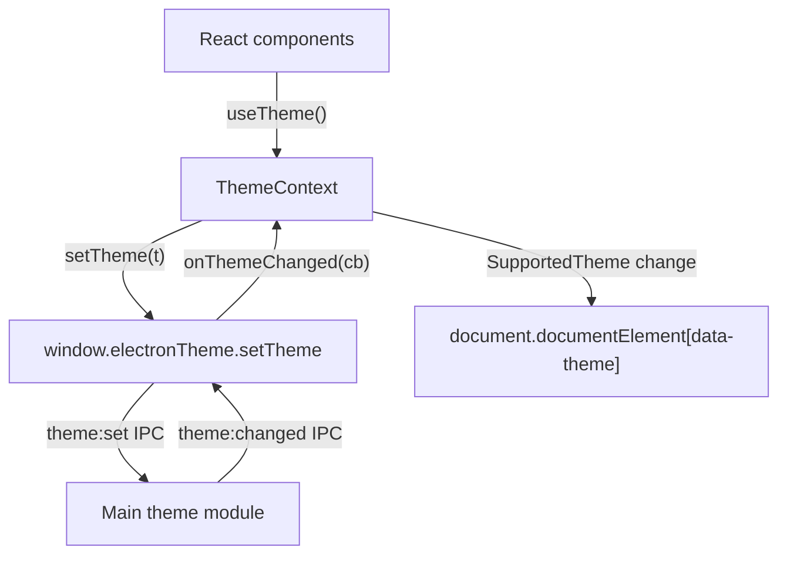

### Goals

- **Provide a React-level theme API** that reflects the Electron theme system (preference vs resolved theme).
- **Keep the renderer wiring minimal**: just a context provider, hook, and root wrapper.
- **Avoid UI changes**: no new components or CSS modifications.

### Files to Create/Update

- **Create** `[src/renderer/theme/ThemeContext.tsx](src/renderer/theme/ThemeContext.tsx)`
- **Create** `[src/renderer/theme/useTheme.ts](src/renderer/theme/useTheme.ts)`
- **Create** `[src/renderer/theme/index.ts](src/renderer/theme/index.ts)`
- **Update** `[src/renderer/src/main.tsx](src/renderer/src/main.tsx)` to wrap the root in `ThemeProvider`.

### Detailed Plan

- **1. Define ThemeContext and provider** (`ThemeContext.tsx`)
  - Import React primitives and types:
    - `createContext`, `useState`, `useEffect`, `useMemo`, `ReactNode` from `react`.
  - Import theme types from the shared module:
    - `import type { SupportedTheme, ThemePreference } from '../../shared/theme.types'` (adjusted path to match workspace structure).
  - Define the context value interface:
    - `interface ThemeContextValue { SupportedTheme: SupportedTheme; preference: ThemePreference; setTheme: (t: ThemePreference) => void }`.
  - Create the context with a nullable default:
    - `const ThemeContext = createContext<ThemeContextValue | null>(null)`.
  - Implement `ThemeProvider` component:
    - Props: `{ children: ReactNode }`.
    - Local state:
      - `const [SupportedTheme, setSupportedTheme] = useState<SupportedTheme>('dark')` (safe default).
      - `const [preference, setPreference] = useState<ThemePreference>('system')`.
      - `const [initialized, setInitialized] = useState(false)` to track first load.
    - **Initial load effect**:
      - On mount, call `window.electronTheme.getTheme()`.
      - On success:
        - `setSupportedTheme(resolved)`.
        - Keep `preference` as `'system'` unless you later extend the API to read it from main; for now, assume `'system'` as default.
        - Mark `initialized` true.
      - On error: log, keep the default `'dark'`, set `initialized` true.
    - **DOM side-effect for `data-theme`**:
      - Use `useEffect` that depends on `SupportedTheme`.
      - It should call `document.documentElement.setAttribute('data-theme', SupportedTheme)`.
      - Because `SupportedTheme` is initialized to `'dark'`, this immediately applies a non-flashy dark theme before the async call completes (per requirements).
    - **Subscribe to native theme updates**:
      - In another `useEffect`, on mount:
        - Call `const unsubscribe = window.electronTheme.onThemeChanged((theme) => setSupportedTheme(theme))`.
        - Return a cleanup function that calls `unsubscribe()`.
      - This ensures the renderer tracks updates pushed from the main process (including when preference is `'system'` and OS theme changes).
    - **Implement `setTheme` callback**:
      - Function `const setThemePreference = (t: ThemePreference) => { setPreference(t); window.electronTheme.setTheme(t); }`.
      - The actual `SupportedTheme` will be updated via the `theme:changed` push.
    - **Memoize context value**:
      - `const value = useMemo(() => ({ SupportedTheme, preference, setTheme: setThemePreference }), [SupportedTheme, preference])`.
    - Render:
      - Return `<ThemeContext.Provider value={value}>{children}</ThemeContext.Provider>` regardless of `initialized` state (since `data-theme` is safely set from the start).
- **2. Implement `useTheme` hook** (`useTheme.ts`)
  - Import `useContext` from `react`.
  - Import `ThemeContext` and `ThemeContextValue` type from `./ThemeContext`.
  - Implement:

```ts
export function useTheme(): ThemeContextValue {
  const ctx = useContext(ThemeContext)
  if (!ctx) {
    throw new Error('useTheme must be used within a ThemeProvider')
  }
  return ctx
}
```

- Export the hook as the default or named export as preferred; the plan will use named exports and central re-exports.
- **3. Create index re-exports** (`index.ts`)
  - Re-export public API from this folder:

```ts
export type { ThemeContextValue } from './ThemeContext'
export { ThemeProvider, ThemeContext } from './ThemeContext'
export { useTheme } from './useTheme'
```

- This centralizes imports for consumers (`import { ThemeProvider, useTheme } from '@renderer/theme'` once aliasing is configured, or via relative paths for now).
- **4. Wrap React root with ThemeProvider** (`src/renderer/src/main.tsx`)
  - Import the provider at the top:
    - `import { ThemeProvider } from '../theme'` (folder path: `src/renderer/theme`, relative to `src/renderer/src` this is likely `../theme`; adjust as needed based on existing aliasing).
  - Wrap the `<App />` in the current root render:

```tsx
createRoot(document.getElementById('root')!).render(
  <StrictMode>
    <ThemeProvider>
      <App />
    </ThemeProvider>
  </StrictMode>
)
```

- No other components or logic changes are needed.

### Data Flow Overview




This plan keeps all behavior scoped to the new `src/renderer/theme/` folder plus a small root wrapper change, and relies entirely on the existing Electron IPC theme integration from Phase 1.