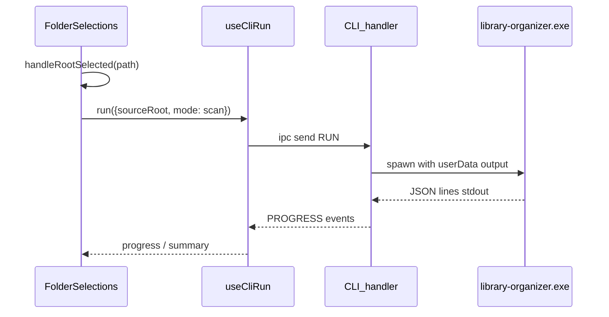

# Auto-run scan on folder selection

## Context

- The main process already spawns the bundled exe via `[src/handlers/cli/handler.ts](src/handlers/cli/handler.ts)` and builds args in `[src/handlers/cli/helpers.ts](src/handlers/cli/helpers.ts)`.
- The renderer should use `[useCliRun](src/renderer/src/hooks/useCliRun.ts)` (not raw `window.appApi`) per project rules.
- `[CliRunArgs](src/handlers/cli/types.ts)` does not yet include `mode: 'scan'`; the spawn path is otherwise ready.

## 1. Extend CLI types

- In `[src/handlers/cli/types.ts](src/handlers/cli/types.ts)`, add `'scan'` to the `mode` union on `CliRunArgs`.
- No preload or `[src/shared/window.types.ts](src/shared/window.types.ts)` changes needed: `CliApi` already uses `CliRunArgs` from the handlers package.

## 2. Stable default `--output` for scan

Without an explicit `--output`, the CLI writes `scan_results.json` relative to the **process cwd**, which is unreliable for a spawned Electron main process.

- In `[getCliFlags](src/handlers/cli/helpers.ts)`, when `args.mode === 'scan'` and `args.output` is absent, set a default path such as `path.join(app.getPath('userData'), \`scan-${Date.now()}.json)`(or similar) and pass`--output` so the report location is predictable and unique per run.
- Keep existing behavior when `args.output` is provided (caller override).

## 3. Auto-run scan when a root folder is chosen

Target: `[FolderSelections.tsx](src/renderer/src/pages/organize/folderSelections/FolderSelections.tsx)`.

- Use `useCliRun()` to obtain `run`, `stop`, `status`, `progress`, and `summary`.
- Replace direct `setTargetPath` usage for **both** browse and drop with a single handler, e.g. `handleRootSelected(path: string)`:
  - `setTargetPath(path)`
  - `run({ sourceRoot: path, mode: 'scan' })` (no `dryRun`; scan is read-only per docs).
- Wire `DropZone` `onSetPath` to this handler (same as browse).

## 4. UX: progress, summary, and cancel

- While `status === 'running'`, show a minimal read-only state (e.g. progress text or a simple bar using `progress.current` / `progress.total` when present).
- On `status === 'done'`, read scan-specific fields from `summary` (per docs: e.g. `total_files`, `folder_count`, `report_path`) and show a short confirmation line.
- On error: if the CLI exits non-zero, today’s line-parser may not emit a `summary`; consider showing a generic failure when the process ends without a summary (optional small follow-up in `cliStore` / handler if you want explicit exit-code handling—only add if you observe silent failures in testing).

## 5. Reset / trash behavior

- When the user clears the selection via `reset()` (trash icon), call `stop()` from `useCliRun` first so an in-flight scan is cancelled (`cli:cancel` → `process.kill`), matching user expectation when changing mind.

## 6. Verification

- Dev: ensure `[resources/library-organizer.exe](resources/library-organizer.exe)` exists locally (gitignored per `[.gitignore](.gitignore)`).
- Run `yarn dev`, pick a small test folder, confirm JSON progress/summary in the UI and a new file under the app userData path.
- `yarn typecheck` after edits.

## Out of scope (later)

- Persisting `report_path` in `[organizeStore](src/renderer/src/stores/organizeStore.ts)` for later wizard steps.
- Reading/parsing the scan JSON in the UI via a new IPC (only needed if you want a full report viewer).
