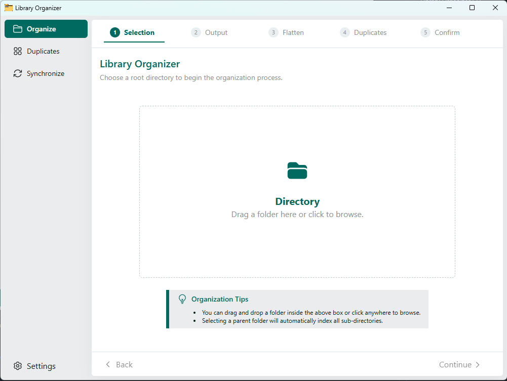
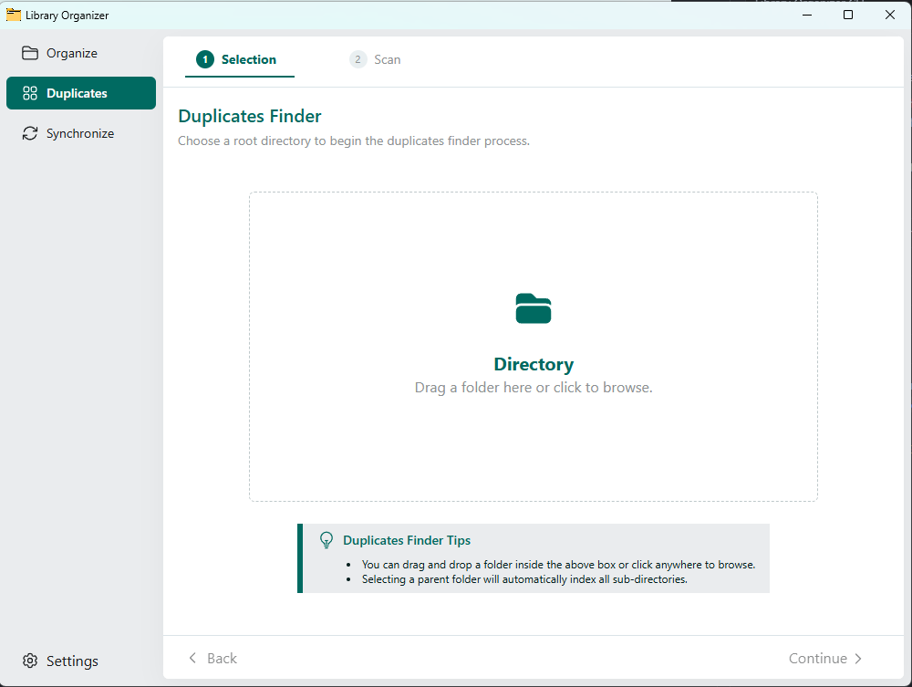
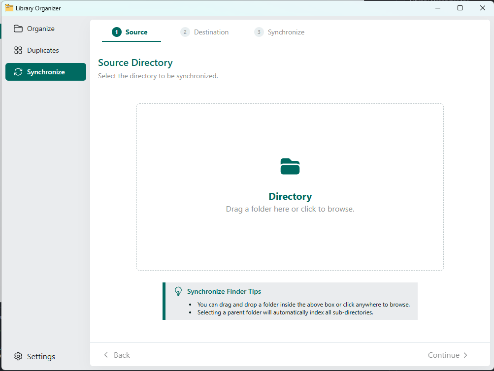
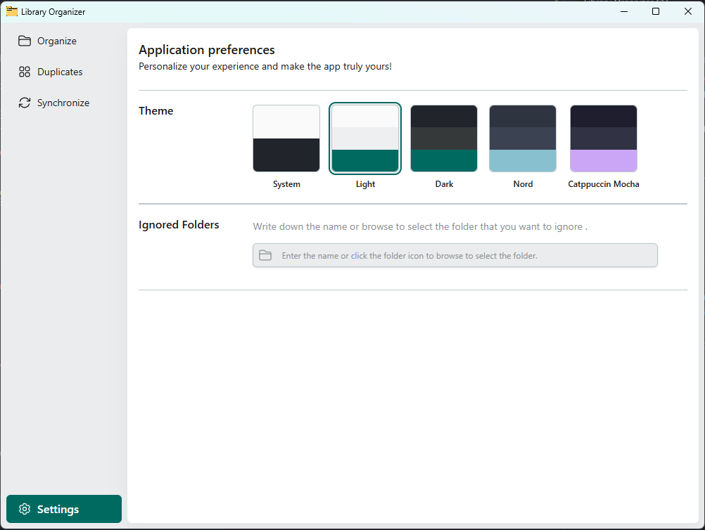

# Library Organizer

Desktop app for organizing your local photo and video library, and cleaning up duplicates safely.

[CI](https://github.com/Youssef-ben/duplicate-files-manager/actions/workflows/ci.yml)
[License: MIT](./LICENSE)
[Node.js](./.nvmrc)

## Table of contents

- [Overview](#overview)
- [Features](#features)
- [Prerequisites](#prerequisites)
- [Tech stack](#tech-stack)
- [Installation](#installation)
- [Usage](#usage)
- [Build](#build)
- [Documentation](#documentation)
- [Contributing](#contributing)
- [License](#license)

## Overview

Library Organizer is a desktop application for scanning, cataloging, and tidying up a local photo and video library. It discovers media files across your folders, reads their metadata (including EXIF where available), and turns a messy folder tree into a predictable, date-based structure.

Content hashing is used to identify duplicates even when filenames differ, so redundant copies can be reviewed and removed. Every destructive action is preview-first: you see a dry-run summary and confirm before anything is written or deleted.

The heavy lifting is done by the [Library Organizer CLI](https://github.com/Youssef-ben/library-organizer-cli), which the app bundles and drives in the background — see the [architecture overview](./docs/top-level-architecture.md).

## Features

### Organize

Pick a messy photo or video folder and organize its files into a clean `year/month` structure. The app works on a separate copy, keeping your original library untouched.

Choose your library and output folder, then let the app consolidate files, detect duplicates, and arrange everything by date. You review every step, and nothing is moved or deleted without your confirmation.



### Duplicates Finder

Point the app at a photo or video folder and find files that are the same even when
their names differ. Matching copies are grouped together so you can compare them side
by side.

Nothing is deleted automatically — you choose what to keep, review the plan, and
confirm before any redundant files are removed.



### Synchronize

Keep two folders in sync by copying what one side has and the other is missing.
Pick a source and a destination, choose the direction (one way or both ways), then
review the planned copies before anything is written.

Nothing is applied until you confirm — so you always see what will change first.



### Settings

Personalize the app to match how you work. Switch between System, Light, Dark, Nord,
and Catppuccin Mocha themes, and exclude folders you never want scanned (for example
caches or system directories).



## Prerequisites

- [Node.js](https://nodejs.org/) 22 or newer (see `[.nvmrc](./.nvmrc)`)
- [Yarn Classic](https://classic.yarnpkg.com/) (v1)

## Tech stack

- Electron + electron-vite
- React + TypeScript
- Tailwind CSS
- Zustand / TanStack Query

## Installation

```bash
git clone https://github.com/Youssef-ben/duplicate-files-manager.git
cd duplicate-files-manager
yarn install
```

## Usage

### Development

```bash
yarn dev
```

### Preview production build

```bash
yarn start
```

### Quality checks

```bash
yarn lint
yarn typecheck
```

## Build

Installers are produced for **Windows** and **Linux**.

```bash
# Windows (NSIS)
yarn build:win

# Linux (AppImage)
yarn build:linux
```

When `package.json` changes on `main` and CI passes, GitHub Actions builds Windows and Linux installers, creates a `v*` tag, and publishes a release if the `version` was bumped — see [`.github/workflows/release.yml`](./.github/workflows/release.yml).

## Documentation

- [Architecture overview](./docs/top-level-architecture.md)
-

## Contributing

Contributions are welcome. Open an issue or pull request.

1. Fork the repository
2. Create a feature branch (`git checkout -b feature/my-change`)
3. Commit your changes
4. Push and open a PR (CI must pass)

## License

[MIT](./LICENSE) © YBensoft
