# High‑level architecture

This app is split into **three layers**, each with a clear responsibility:

## 1. Renderer (UI layer)

- **Technology**: React + TypeScript
- **Responsibility**: Pure UI; no direct access to Node or the CLI.
- **Communication**: Talks to the Main process **only** through typed IPC channels  
  (e.g. `window.api.invoke(...)`).
- **Key idea**: The renderer “doesn’t know” how the CLI works; it just sends/receives well‑typed messages.

## 2. Main process (orchestration layer)

- **Responsibility**:
  - Spawns the CLI as a child process.
  - Routes IPC between the renderer and the CLI.
  - Handles OS integrations (e.g. folder picker dialogs).
- **How it works**:
  - Reads the CLI’s `stdout` line by line.
  - Parses **JSON progress events** emitted by the CLI.
  - Forwards those events to the renderer using `webContents.send`.

## 3. CLI (engine layer)

- **Responsibility**: Does the actual heavy lifting (e.g. scanning files, detecting duplicates).
- **Treatment**: It’s a **black box** from Electron’s perspective:
  - Electron passes the right flags.
  - Electron parses whatever the CLI prints.
- **Contract**: The `--progress-format json` flag defines the main integration seam:
  - The CLI prints machine‑readable JSON lines.
  - The Main process parses them and pushes updates to the UI.

## Deployment detail

- The bundled CLI executable (e.g. `.exe`) lives next to the Electron app in the `resources/` folder.
- At runtime, it is resolved using:
  - `app.getAppPath()` during development, or
  - `process.resourcesPath` in production builds.
